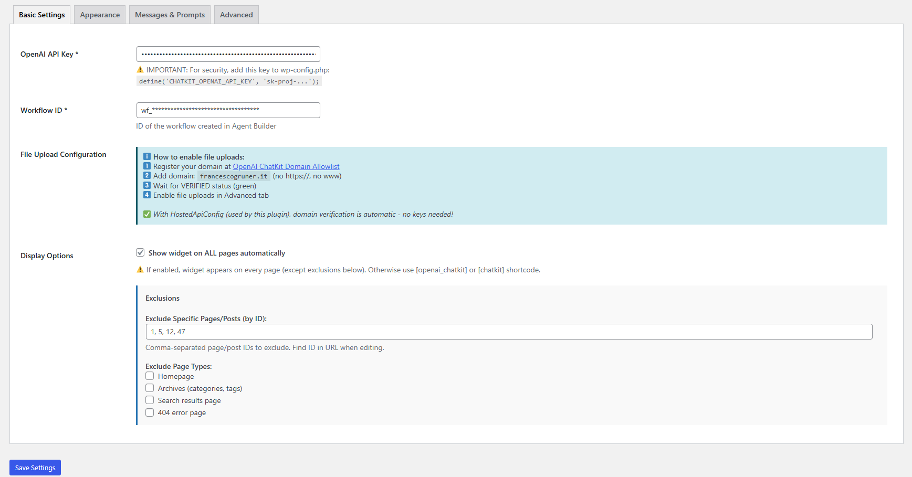

# OpenAI ChatKit for WordPress

**Contributors:** francescogruner  
**Tags:** openai, chatkit, chatbot, ai, assistant, widget, chat, conversational-ai  
**Requires at least:** 5.8  
**Tested up to:** 6.5  
**Requires PHP:** 7.4  
**Stable tag:** 1.0.3  
**License:** GPL-2.0-or-later  
**License URI:** https://www.gnu.org/licenses/gpl-2.0.html

Integrate OpenAI's ChatKit into your WordPress site with guided setup, file uploads, custom styling, and multi-language support.

---

## 📖 Description

This plugin seamlessly integrates OpenAI's ChatKit into your WordPress website, providing a powerful AI chatbot with advanced customization options. Perfect for customer support, lead generation, and interactive user engagement.

### ✨ Key Features

#### 🎨 **Complete Visual Customization**
- **Accent Colors** with 4 intensity levels (Subtle, Light, Normal, Bold)
- **Light/Dark Theme** modes
- **Button Customization**: size (small, medium, large), position (4 corners), custom text
- **Border Radius**: square, round, or extra-round
- **Shadow Styles**: subtle, normal, or bold
- **UI Density**: compact, normal, or comfortable spacing
- **Custom Typography**: use your own fonts and sizes

#### 💬 **Multi-language Support**
- Fully translatable admin interface (Italian translation included)
- Custom greeting messages and placeholder text
- Locale override support (en-US, it-IT, de-DE, fr-FR, etc.)
- Support for any language in your content

#### 🎯 **Quick Prompts**
- Configure up to **5 quick prompts** with custom icons
- Each prompt has a display label and actual message text
- Choose from validated icons: Question, Search, Write, Home, Info
- Perfect for guiding users to common questions

#### 📎 **File Upload Support**
- Enable PDF, images (PNG, JPG, GIF, WebP), and TXT uploads
- Configure max file size (1-100 MB)
- Set max files per message (1-10)
- Automatic domain verification via HostedApiConfig
- Integrated with OpenAI ChatKit Domain Allowlist

#### 🎛️ **Advanced Header Configuration**
- Custom static title or dynamic thread titles
- Left and right action buttons (Home, Settings, Menu icons)
- Clickable buttons with custom URLs
- Show/hide header completely

#### 🔧 **Flexible Display Options**
- **Global widget**: show on all pages automatically
- **Shortcode mode**: use `[openai_chatkit]` or `[chatkit]` on specific pages
- **Smart exclusions**: 
  - Exclude by page/post ID
  - Exclude homepage, archives, search results, or 404 pages
- **Persistent sessions**: remember conversations via cookies (optional)
- **History panel**: enable/disable conversation history sidebar

#### 📋 **Additional Features**
- Disclaimer text with high-contrast option
- Initial thread ID support (resume specific conversations)
- Rate limiting protection (10 requests/minute per visitor)
- WP REST API integration for secure session management
- API connection testing tool in admin panel
- Responsive design (mobile, tablet, desktop)
- WordPress Admin Bar compatibility
- Accessibility features (ARIA labels, keyboard navigation, high contrast mode)

---

## 📸 Screenshots

### Admin Settings Page


### Live Chat Widget on Frontend


---

## 🚀 Installation

### Method 1: Upload via WordPress Admin
1. Download the latest release from [GitHub Releases](https://github.com/francescogruner/openai-chatkit-wordpress/releases)
2. In WordPress, go to **Plugins → Add New → Upload Plugin**
3. Choose the `.zip` file and click **Install Now**
4. Activate the plugin

### Method 2: Manual Installation
1. Download and extract the plugin files
2. Upload the `chatkit-wp` folder to `/wp-content/plugins/`
3. Activate the plugin through the **Plugins** menu in WordPress

### Method 3: Via Composer
```bash
composer require francescogruner/openai-chatkit-wordpress
```

---

## ⚙️ Configuration

### Step 1: Create OpenAI Workflow
1. Visit [OpenAI Agent Builder](https://platform.openai.com/agent-builder) (requires login)
2. Create your AI agent workflow
3. Copy the **Workflow ID** (starts with `wf_`)

### Step 2: Get API Credentials
1. Generate an **API Key** from [OpenAI Dashboard](https://platform.openai.com/api-keys)
2. **Important for security**: Add the API key to `wp-config.php`:
   ```php
   define('CHATKIT_OPENAI_API_KEY', 'sk-proj-your-key-here');
   ```

### Step 3: Enable File Uploads (Optional)
1. Visit [OpenAI ChatKit Domain Allowlist](https://platform.openai.com/settings/organization/chatkit)
2. Add your domain (e.g., `example.com` - no `https://`, no `www`)
3. Wait for **VERIFIED** status (green checkmark)
4. Enable file uploads in plugin's **Advanced** tab

### Step 4: Configure Plugin
1. In WordPress, go to **Settings → ChatKit**
2. Enter your **Workflow ID**
3. If not using `wp-config.php`, enter your **API Key**
4. Customize appearance, messages, and prompts
5. Click **Save Settings**
6. Click **🔍 Test API Connection** to verify setup

### Step 5: Display the Widget
Choose one of two methods:

**Option A: Global Widget**
- Check **"Show widget on ALL pages automatically"** in Display Options
- Configure exclusions if needed

**Option B: Shortcode**
- Add `[openai_chatkit]` or `[chatkit]` to any page/post
- Customize per-page with shortcode attributes:
  ```
  [openai_chatkit button_text="Chat with us" accent_color="#FF6B35"]
  ```

---

## 🎨 Customization Guide

### Appearance Settings

#### Colors
- **Accent Color**: Primary brand color (HEX format)
- **Accent Level**: 0 (subtle) to 3 (bold) - controls color intensity throughout UI

#### Button Styling
- **Size**: Small (8px padding), Medium (12px), Large (14px)
- **Position**: Bottom-right, Bottom-left, Top-right, Top-left
- **Border Radius**: Square (8px), Round (16px), Extra-round (24px/50px)
- **Shadow**: Subtle, Normal, or Bold

#### UI Density
- **Compact**: Tight spacing, more content visible
- **Normal**: Balanced (default)
- **Comfortable**: Spacious, easier to read

### Quick Prompts Configuration

Configure up to 5 prompts in **Messages & Prompts** tab:

**Example Setup:**
```
Prompt 1:
  Label: "Product Information"
  Text: "Can you tell me about your products?"
  Icon: Search

Prompt 2:
  Label: "Support"
  Text: "I need help with my order"
  Icon: Question

Prompt 3:
  Label: "Pricing"
  Text: "What are your pricing plans?"
  Icon: Info
```

### Header Customization

**Custom Title:**
- Set a static title (e.g., "Customer Support")
- Leave empty to show dynamic thread titles

**Action Buttons:**
- **Left Button**: Commonly used for Menu or Settings
- **Right Button**: Typically for Home or additional Settings
- Supported icons: `home`, `settings-cog`, `menu`
- Click action: Navigate to custom URL

**Example:**
```
Left Button: menu → https://yoursite.com/help
Right Button: home → https://yoursite.com
```

### File Upload Settings

**Requirements:**
1. Domain registered on OpenAI ChatKit Dashboard
2. Verified status (green checkmark)
3. File uploads enabled in **Advanced** tab

**Configuration:**
- **Max file size**: 1-100 MB (default: 20 MB)
- **Max files per message**: 1-10 files (default: 3)
- **Supported formats**: 
  - Documents: PDF, TXT
  - Images: PNG, JPG, JPEG, GIF, WebP

### Exclusion Rules

**Exclude Specific Pages:**
```
Page IDs: 12, 47, 105
```

**Exclude Page Types:**
- ☑️ Homepage
- ☑️ Category/Tag Archives  
- ☑️ Search Results
- ☑️ 404 Error Pages

---

## 🔧 Advanced Configuration

### Custom Typography
```php
// In Advanced → Custom Typography
Enable custom font: ✅
Font Family: 'Inter', 'Roboto', sans-serif
Base Font Size: 16px
```

**Note:** Font must be web-safe or loaded by your theme/another plugin.

### Locale Override
Set language code to override browser default:
- English (US): `en-US`
- Italian: `it-IT`
- German: `de-DE`
- French: `fr-FR`
- Spanish: `es-ES`

### Disclaimer Text
Add legal disclaimer or AI warning:
```
Markdown text displayed below composer:

"⚠️ AI responses may contain errors. Please verify important information."

☑️ High contrast (more visible)
```

### Initial Thread ID
Resume a specific conversation on chat open:
```
thread_abc123xyz
```
Leave empty for new conversations.

---

## 🛠️ Troubleshooting

### Chat Won't Load
1. **Test API Connection** in Settings → ChatKit
2. Verify Workflow ID starts with `wf_`
3. Check API Key is valid (regenerate if needed)
4. Open browser console (F12) for error messages

### File Uploads Not Working
1. Verify domain is **VERIFIED** (green) on OpenAI Dashboard
2. Confirm domain format: `example.com` (no protocol, no www)
3. Wait 5-10 minutes after domain verification
4. Check browser console for upload errors

### Widget Not Showing
1. Verify shortcode spelling: `[openai_chatkit]` or `[chatkit]`
2. If using global mode, check exclusion rules
3. Disable caching plugins temporarily
4. Check browser console for JavaScript errors

### Styling Issues
1. Clear WordPress cache and browser cache
2. Check for theme CSS conflicts (use browser inspector)
3. Test with default WordPress theme (Twenty Twenty-Four)

### Rate Limit Errors
- Default: 10 requests per minute per visitor
- Admins: 100 requests per minute
- Wait 60 seconds and try again

---

## 🔒 Security Best Practices

### API Key Storage
**✅ Recommended (Secure):**
```php
// In wp-config.php
define('CHATKIT_OPENAI_API_KEY', 'sk-proj-your-key-here');
define('CHATKIT_WORKFLOW_ID', 'wf_your-workflow-id');
```

**❌ Not Recommended:**
- Storing API key in database (via admin panel)
- Committing API keys to version control

### Rate Limiting
Built-in protection prevents abuse:
- Tracks requests by IP + User Agent
- 60-second cooldown period
- Separate limits for admins and visitors

### Session Security
- CSRF protection via WordPress nonces
- Same-origin policy enforcement
- Secure cookie handling (HttpOnly, SameSite)

---

## 🌍 Translation

### Available Languages
- 🇬🇧 English (default)
- 🇮🇹 Italian (included)

### Add Your Language
1. Copy `languages/chatkit-wp.pot`
2. Translate using [Poedit](https://poedit.net/) or similar tool
3. Save as `chatkit-wp-{locale}.po` and `.mo`
4. Place in `wp-content/languages/plugins/`

**Example:**
```
chatkit-wp-de_DE.po  (German)
chatkit-wp-fr_FR.po  (French)
chatkit-wp-es_ES.po  (Spanish)
```

---

## 📚 Developer Documentation

### Shortcode Attributes
```php
[openai_chatkit 
  button_text="Custom Text"
  accent_color="#FF6B35"]
```

### Filter Hooks
```php
// Customize session user ID
add_filter('chatkit_user_id', function($user_id) {
    return 'custom_' . $user_id;
});
```

### Action Hooks
```php
// After settings save
add_action('chatkit_settings_saved', function() {
    // Your custom logic
});
```

### REST API Endpoints
- `POST /wp-json/chatkit/v1/session` - Create ChatKit session
- `POST /wp-json/chatkit/v1/test` - Test API connection

---

## 📋 Requirements

- **WordPress:** 5.8 or higher
- **PHP:** 7.4 or higher
- **OpenAI Account:** [Sign up](https://platform.openai.com/signup)
- **OpenAI API Key:** [Generate key](https://platform.openai.com/api-keys)
- **ChatKit Workflow:** [Create workflow](https://platform.openai.com/agent-builder)

---

## 📝 Changelog

### 1.0.3 (2025-01-15)
**Added:**
- File upload support with configurable size and count limits
- 5 quick prompts (up to from 3)
- Custom header with action buttons (left/right)
- Static header title option
- Accent level control (0-3 intensity)
- UI density options (compact, normal, comfortable)
- Custom typography support
- Locale override
- Disclaimer text with high-contrast mode
- Initial thread ID support
- History panel toggle
- Exclusion rules (by ID and page type)

**Improved:**
- Domain verification via HostedApiConfig (no manual keys)
- Enhanced error handling and user feedback
- Better mobile responsiveness
- Accessibility features (ARIA labels, keyboard nav)
- Admin UI with tabbed interface

**Fixed:**
- Persistent session cookie handling
- Rate limiting accuracy
- WordPress Admin Bar compatibility
- Theme CSS conflicts

### 1.0.1 (2025-01-10)
- Added customizable greeting and quick questions (up to 3)
- Improved admin settings interface
- Added Italian translation

### 1.0.0 (2024-12-15)
- Initial release
- Basic ChatKit integration
- Accent color and theme customization
- Shortcode and global widget support

---

## 💬 Support

### Get Help
- 📖 [Documentation](https://github.com/francescogruner/openai-chatkit-wordpress/wiki)
- 🐛 [Report Issues](https://github.com/francescogruner/openai-chatkit-wordpress/issues)
- 💡 [Feature Requests](https://github.com/francescogruner/openai-chatkit-wordpress/discussions)

### Useful Links
- [OpenAI ChatKit Documentation](https://platform.openai.com/docs/chatkit)
- [OpenAI Agent Builder](https://platform.openai.com/agent-builder)
- [OpenAI API Reference](https://platform.openai.com/docs/api-reference)

---

## 🙏 Attribution & Credits

**Original Author:** [Francesco Grüner](https://francescogruner.it)

If you modify or build upon this code, please:
- Retain the original author's name
- Maintain the GPL v2 license
- Link back to the original repository

---

## 📄 License

This plugin is licensed under the **GPL v2 or later**.

```
Copyright (C) 2025 Francesco Grüner

This program is free software; you can redistribute it and/or modify
it under the terms of the GNU General Public License as published by
the Free Software Foundation; either version 2 of the License, or
(at your option) any later version.

This program is distributed in the hope that it will be useful,
but WITHOUT ANY WARRANTY; without even the implied warranty of
MERCHANTABILITY or FITNESS FOR A PARTICULAR PURPOSE. See the
GNU General Public License for more details.
```

Full license: https://www.gnu.org/licenses/gpl-2.0.html

---

## ⭐ Show Your Support

If this plugin helps your project:
- ⭐ Star the repository on GitHub
- 🐛 Report bugs or suggest features
- 🌍 Contribute translations
- 📢 Share with others who might benefit

**Made with ❤️ by [Francesco Grüner](https://francescogruner.it)**
